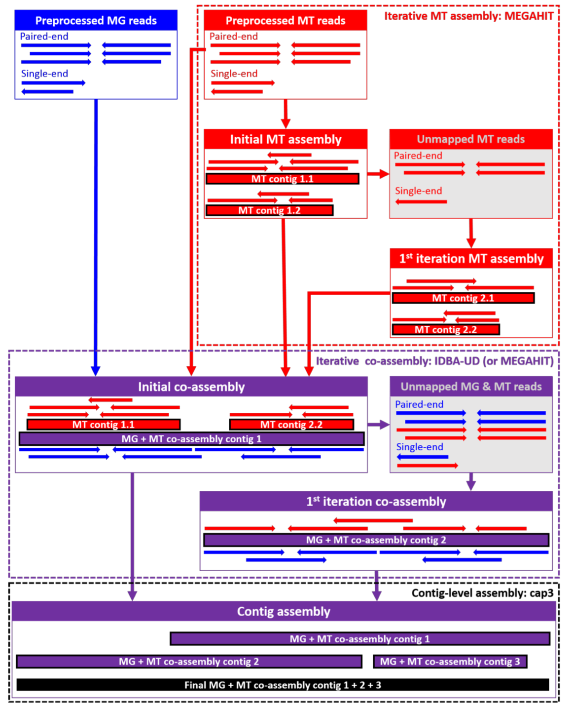

.. _process:

====================================================
Part 0: Recap: what's happened with the data so far?
====================================================

We're starting this practical session off with an annotated assembly and some metatranscriptomic reads. You've previously seen how genes are annotated on (metagenomic) contigs. This information forms the basis of the interpretation of metatranscriptomics.

The annotated assembly we are using in this practical is based on metagenomics and metatranscriptomics short reads. As a first step, they were trimmed to remove remainders of adapters and filtered for quality.

In the next step, certain uninformative reads were removed. In our case, we removed contaminant sequences, like the phiX174 genome. This step could also target host genomes. 

.. admonition:: metaT-specific filtering

   If you sequence metatranscriptomic reads after ribo-depletion, there will always be some rRNA-fragments left over. These are not representatitve of the metatranscriptomics information, so it's best practice to remove them from the metaT reads, too.

We achieved :ref:`rRNA removal<rule-filter>` by mapping against an rRNA database.

The next step was assembly. In our case, we use an :ref:`iterative (step-by-step) hybrid assembly<rule-ass>` of metatranscriptomics and metagenomics reads: the assembly starts with a metatranscriptomics assembly. The rationale is that there are some strongly expressed (and hence deeply covered) genes and operons which are better represented by the metatranscriptome than the metagenome. The assembled transcripts form one input to the hybrid assembly, together with the metagenomics and metatranscriptomics reads. In our case, we then map the reads back to the hybrid-assembled contigs and extract reads that do not map, i.e. that are not used/represented by the assembly. We assemble these like the original set of reads and then merge both sets of contigs. 

This approach has been `shown <https://doi.org/10.1186/s13059-016-1116-8>`_ to lead to higher mapping rates, especially for the metatranscriptomic reads, than metagenomics-only assembly. There are however also situations, where you'd preferably assemble the metagenomics reads only -- for example, if you expect to have intron-rich metatranscriptomes or if your metatranscriptome is sequenced too shallow.

.. admonition:: What if I have only metaT reads?

   It's possible to assembly metatranscriptomic reads on their own, of course. We will look at what the metatranscriptomics assembly recovers :ref:`later<compareAss>`.
 
In any case, the next step will be to call genes and annotate them. We have used `prokka <https://doi.org/10.1093/bioinformatics/btu153>`_ and `HMMER3 <http://hmmer.org/>`_ for :ref:`this purpose <rule-a>`. In this hands-on session, we will use the KEGG orthologous group (KO) annotation. The annotation data is contained in a `GFF <http://www.ensembl.org/info/website/upload/gff.html>`_ file.

The other information that is needed for this session is the read alignment information, that is which read maps to the assembly at which position. We've :ref:`generated <rule-map>` this using `BWA-MEM <http://bio-bwa.sourceforge.net/bwa.shtml>`_. 

