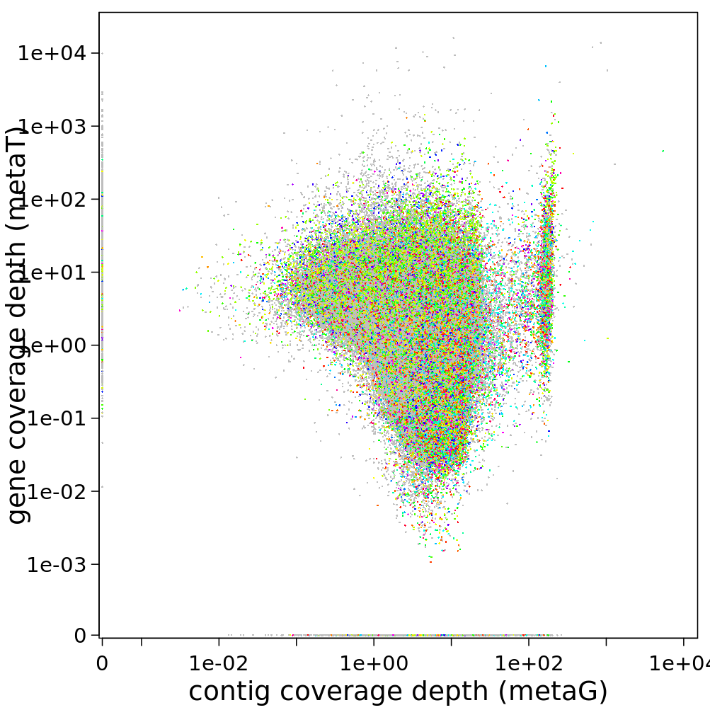

.. _visTG_genes:

===========================================
Part 2: Compare metaT & metaG at gene level
===========================================

In this and the next part of the tutorial, you'll quickly visualize the results from the last step.

First, check how many open reading frames there are in your sample:

.. code-block:: console

   grep -P "\tCDS\t" -c /work/projects/embomicrobial2020/data/metaT/annotations/$mySample/$mySample.annotation_CDS_RNA_hmms.gff

Note this number.

Then have a look at the correlation between metagenomics and metatranscriptomics read mapping to all the open reading frames in the dataset. Probably the easiest option is to plot this in R (R is installed in the featureCounts environment).

.. code-block:: console

   R 

Within R, you can simply read the featureCounts results. 

.. code-block:: console

   mgmt <- read.delim("mgmt.CDS_counts.tsv",skip=1,stringsAsFactors=F)[,c(1,7,8)]
   colnames(mgmt)[2:3] <- c("metaG","metaT") 

.. warning:: 

   Make sure that you entered the metaG input first into the featureCounts call, in order for the above column names assignment to be correct. You can check the top of the mgmt file, using the ``head`` function (either in the shell or in R).

You can first compare the number of genes that are in your featureCounts output to the number of CDS' in the GFF file.

.. code-block:: console

   dim(mgmt)

Then you can check, how many genes are not mapped by either metagenomics or metatranscriptomics reads:

.. code-block:: console

   length(which(mgmt$metaG+mgmt$metaT==0))

You can also see, how many genes are detected in only metagenomics:

.. code-block:: console

   length(which(mgmt$metaG>0 & mgmt$metaT==0))

Can you add the code to figure out the number of genes that are only detected in metatranscriptomics? And the numbers of genes that are covered by both kinds of reads?

You can also visualize these relationships. 

.. code-block:: console

   min0 <- function(x){
     min(x[x>0])
   }  

   png("scatterplot.genes.png",width=8.5,height=8.5,units = "cm",res=300,pointsize=7)
   par("mar"=c(2.9,4,0.5,0.5),tcl="-0.3",mgp=c(1.7,0.5,0),lwd=0.5)
   plot(mgmt$metaG,mgmt$metaT,
       pch=16,cex=0.2,log="xy",
       las=1,xlim=c(min0(mgmt$metaG)/11,max(mgmt$metaG)/1.2),
       xaxs="i",
       ylim=c(min0(mgmt$metaT)/11,max(mgmt$metaT)/1.2),
       yaxs="i",
       ylab="",
       xlab="gene coverage (metaG reads)",cex.lab=9/7,axes=F)
  points(mgmt$metaG[mgmt$metaT==0],
         rep(min0(mgmt$metaT)/10,length(which(mgmt$metaT==0))),
         pch=16,cex=0.2)
  points(rep(min0(mgmt$metaG)/10,length(which(mgmt$metaG==0))),
         mgmt$metaT[mgmt$metaG==0],
         pch=16,cex=0.2)
  mtext("gene coverage (metaT reads)",2,2.8,cex=9/7)
  axis(1,
       at=c(min0(mgmt$metaG)/10,10^c(-3:8)),
       labels=c(0,format(10^c(-3:8),scientific=T,digits = 2)),lwd=0.5,las=1)
  axis(2,at=c(min0(mgmt$metaT)/10,10^c(-3:8)),
       labels=c(0,format(10^c(-3:8),scientific=T,digits = 2)),lwd=0.5,las=1)
  box(bty="o")
  dev.off()

In the IMP3-report, the same visualization is given, but here the average coverage depth is used, and the genes are coloured by function:

You can find the files containing the coverage information in ``/work/projects/embomicrobial2020/data/$mySample/run1hybrid/Stats/mg/annotation/mg.gene_depth.txt``. Visualize this, too, if you want some practice with R.

