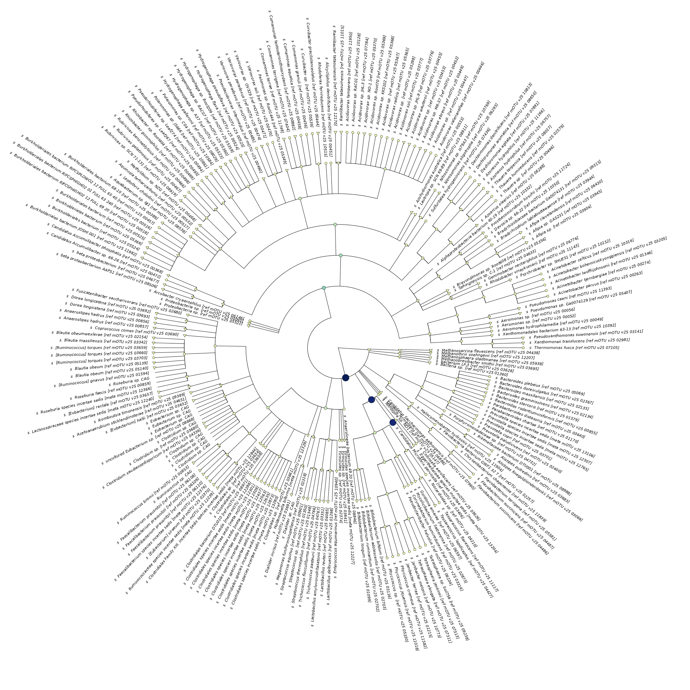
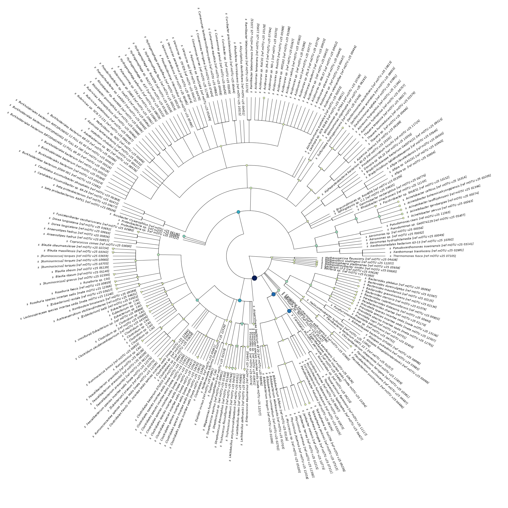

.. _visTG_KO:

===========================================
Part 4: Compare metaT & metaG at mOTU level
===========================================

Because the `mOTUs2 <https://doi.org/10.1038/s41467-019-08844-4>`_ method uses the same housekeeping genes to estimate the abundance of taxa in a metagenomics sample, it can also be used to profile a metatranscriptome.

You can find the output of mOTUs2 at metagenomic and metatranscriptomic level in ``/work/projects/embomicrobial2020/data/metaT/taxonomy/$mySample``. Try, if you can visualize this in the same way as the KO data in the previous part.

Here is an example with scatter plots at multiple taxonomic ranks:

.. image:: _static/Taxonomy_mOTU_plot.png

In this tree-visualization, which is part of IMP3's report, you can also see the names and phylogeny of the taxa. The nodes are coloured according to the relative abundance. 

If you compare this to metatranscriptomic output below, you see some subtle differences:

.. admonition:: Comment

   With a few lines of code, you can concatenate data from several samples to do statistical analyses on the mOTU-profiles. Since this taxonomic profile data does not meet all the assumptions of the DESeq2 test, it's better to analyse them with statistical packages developed for microbiome data, e.g. `ANCOM-II <https://github.com/FrederickHuangLin/ANCOM>`_ or `corncob <https://www.ncbi.nlm.nih.gov/pmc/articles/PMC7514055/>`_. 

